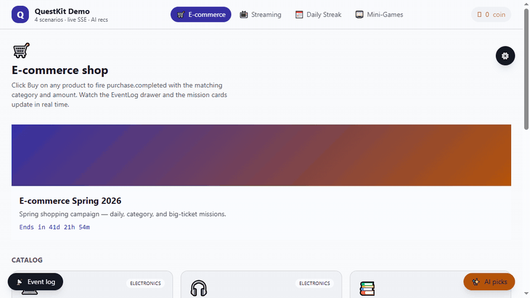
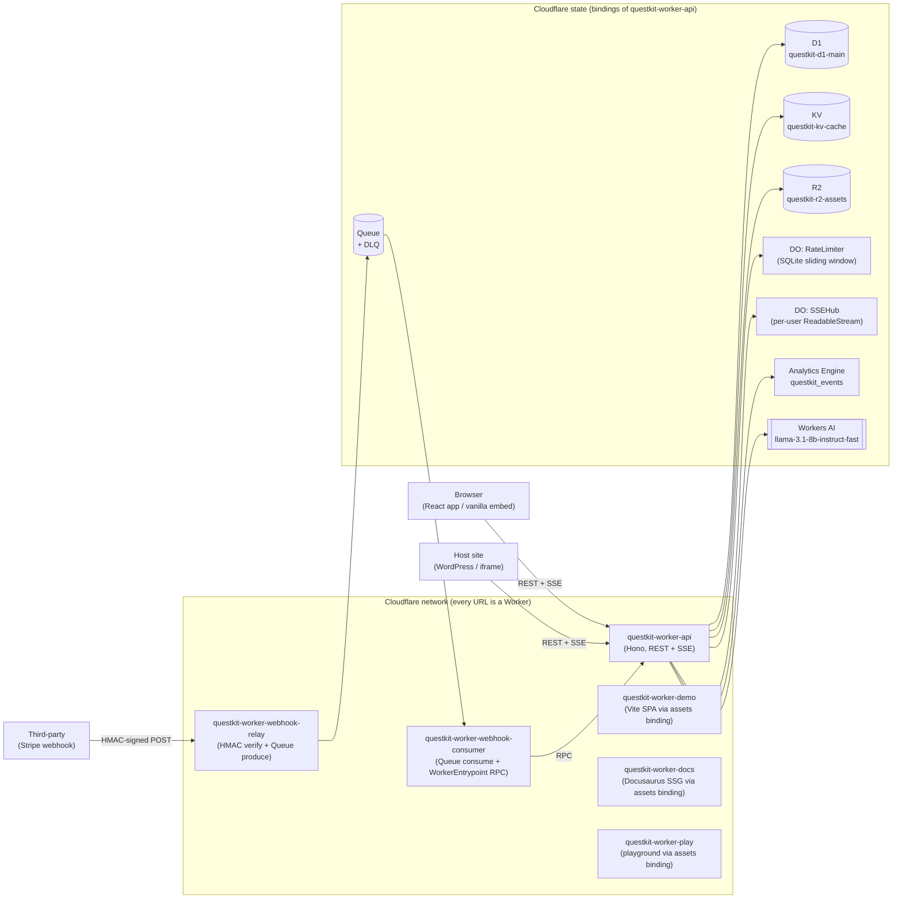

<h1 align="center">QuestKit</h1>

<p align="center">
  <a href="https://questkit.jairukchan.com"></a>
</p>

<p align="center">
  
</p>

<p align="center">
  <a href="https://questkit.jairukchan.com"><strong>Live Demo</strong></a> ·
  <a href="https://docs.questkit.jairukchan.com">Documentation</a> ·
  <a href="https://play.questkit.jairukchan.com">Embed Playground</a> ·
  <a href="docs/SELF_HOSTING.md">Self-Hosting Guide</a>
</p>

<p align="center">
  <em>An embeddable gamification SDK, fully built on Cloudflare's developer platform.</em><br/>
  Missions, rewards, campaigns, and AI-powered recommendations in a single drop-in script.
</p>

<p align="center">
  <a href="./LICENSE"></a>
  <a href="https://github.com/ilGentEAcutoO/QuestKit/actions/workflows/ci.yml"></a>
  <a href="https://sonarcloud.io/summary/new_code?id=ilGentEAcutoO_QuestKit"></a>
  <a href="https://www.npmjs.com/package/@questkit/react"></a>
  <a href="./packages/embed"></a>
  <a href="https://workers.cloudflare.com/"></a>
</p>

---

## What is QuestKit?

QuestKit is a small, opinionated **gamification toolkit** you can drop into any
web app to add missions, rewards, balances, campaigns, and live progress.
It ships as a typed React component library plus a vanilla `<script>` embed,
so it works whether your host is Next.js, vanilla HTML, WordPress, or an
iframe — and it talks to a single Cloudflare-Workers backend that handles
auth, the rule engine, real-time fan-out, and AI-powered recommendations.

The "fully on Cloudflare" part is the interesting design constraint: every
URL terminates at a Worker (the API, the demo, the docs, the playground,
even the webhook ingest). State lives in **D1** (truth), **KV**
(idempotency + JWT denylist), **R2** (asset blobs), **Durable Objects**
(per-user SSE hubs + per-JWT sliding-window rate limit), **Queues**
(webhook async retry + DLQ), **Analytics Engine** (event metrics), and
**Workers AI** (Llama 3.1 8B Fast for mission recommendations). No external
runtime, no third-party stateful service. The whole thing fits in the free
tier for low-volume use.

This is a portfolio project — see [Why I Built This](#why-i-built-this) for
the candid take.

## Quick Start

### React (≤ 30 seconds)

```bash
pnpm add @questkit/react @questkit/core
```

```tsx
import { QuestKitProvider, MissionList, CoinBalance } from "@questkit/react";

const config = {
  apiUrl: "https://api.questkit.jairukchan.com",
  token: "<JWT minted from your backend via POST /v1/auth/token>",
};

export function App() {
  return (
    <QuestKitProvider config={config}>
      <CoinBalance />
      <MissionList />
    </QuestKitProvider>
  );
}
```

Your backend mints the JWT once via `POST /v1/auth/token` (carries
`APP_SECRET`; never call this from the browser) and ships the token to
the client. The SDK handles the SSE reconnect loop, polling fallback,
event queue, and retries.

### Vanilla `<script>` embed

```html
<div
  data-questkit
  data-api="https://api.questkit.jairukchan.com"
  data-token="<your JWT>"
  data-theme="auto"
></div>
<script
  src="https://cdn.jsdelivr.net/npm/@questkit/embed/dist/questkit.iife.js"
  defer
></script>
```

Shadow-DOM isolated, ~59 KB gzipped, mounts itself on `DOMContentLoaded`,
and re-mounts on `qk:reinit` events for SPA hosts.

Full docs: <https://docs.questkit.jairukchan.com>.

## Features

- ✅ **React component library** with strict TypeScript types and a `^18 || ^19` peer-dep
- ✅ **Vanilla JS embed** for non-React hosts — Shadow-DOM isolated styles, no host CSS bleed
- ✅ **Event-driven mission rule engine** — `daily` / `weekly` / `lifetime` windows + filter clauses (`eq`, `gte`, `in`, …)
- ✅ **Real-time updates over SSE**, backed by a per-user Durable Object hub with polling fallback
- ✅ **Webhook ingestion** with Stripe-style HMAC-SHA256 verification + async Cloudflare Queue with DLQ
- ✅ **AI-powered mission recommendations** via Workers AI (`@cf/meta/llama-3.1-8b-instruct-fast`)
- ✅ **JWT auth** (HS256, Web Crypto), idempotent event ingestion, per-JWT sliding-window rate limit in a SQLite Durable Object
- ✅ **Themeable** via CSS variables — five tokens (`--color-qk-primary`, `--color-qk-bg`, `--color-qk-fg`, `--color-qk-coin`, `--radius-qk`) override every widget
- ✅ **Mini-game widgets** — `<SpinWheel>` (SVG rotation) and `<ScratchCard>` (canvas) wired to the reward pipeline
- ✅ **Cloudflare-native** — every URL terminates at a Worker; no Pages, no Vercel, no third-party runtime

## Architecture



See [`docs/decisions/`](docs/decisions/) for ADRs covering the five
non-obvious choices (Cloudflare-only, React-over-Vue, SSE-over-WebSockets,
DO-for-rate-limiting, Workers-AI-for-personalization, and the test-boundary
pattern between service-layer stubs and `@cloudflare/vitest-pool-workers`).

## Why I Built This

I'm a Vue developer by trade who'd been writing Cloudflare Workers for a
while. I wanted a single project that would let a recruiter or senior
engineer answer two questions in under twenty seconds: _can this person
build production-grade React, and do they actually understand the
Cloudflare developer platform end-to-end?_ So I picked a problem that
needed both — a small gamification SDK with a typed component library,
real-time progress, AI personalization, and webhook ingestion — and I
built it in **six days using Claude Code**, one phase per day, with the
plan, decisions, and lessons committed to the repo alongside the code.

The honest take on the React choice lives in
[ADR-002](docs/decisions/002-react-instead-of-vue.md): the rule engine,
SSE client, event queue, and AI prompt all live in `@questkit/core` and
are framework-neutral. A `@questkit/vue` adapter would be a thin layer
over the same core, and is in the v0.2 roadmap. Until then, the React
peer-dep `^18.3 || ^19` is a competency demo, not a religious choice.

If you're skimming, the things to look at:
[`packages/core/src`](packages/core/src) (rule engine + SDK),
[`workers/api/src`](workers/api/src) (Hono routes + Durable Objects),
[`docs/decisions/`](docs/decisions/) (6 ADRs), and the demo at
<https://questkit.jairukchan.com>.

## Tech Stack

| Layer         | Choice                                                                        | Notes                                                                                                       |
| ------------- | ----------------------------------------------------------------------------- | ----------------------------------------------------------------------------------------------------------- |
| Runtime       | Cloudflare Workers (6 workers)                                                | Static assets via `[assets]` binding (Workers Static Assets), no Pages                                      |
| Database      | Cloudflare D1                                                                 | `questkit-d1-main`; prepared statements only                                                                |
| Cache / dedup | Cloudflare KV                                                                 | `questkit-kv-cache`; idempotency 24 h + JWT denylist                                                        |
| Blob          | Cloudflare R2                                                                 | `questkit-r2-assets`; badge icons + campaign banners                                                        |
| Real-time     | Durable Object `SSEHub`                                                       | per-user `ReadableStream`, polling fallback                                                                 |
| Rate limit    | Durable Object `RateLimiter` (SQLite)                                         | per-JWT sliding window                                                                                      |
| Async ingest  | Cloudflare Queues + DLQ                                                       | `questkit-queue-webhooks` + `…-dlq`, `max_retries: 5`, exponential backoff                                  |
| Metrics       | Analytics Engine                                                              | `questkit_events` dataset                                                                                   |
| AI            | Workers AI                                                                    | `@cf/meta/llama-3.1-8b-instruct-fast` (see [ADR-005](docs/decisions/005-workers-ai-for-personalization.md)) |
| Build         | Turborepo `^2.9` + pnpm `10.27` + tsdown                                      | strict TS 5.8.3 (`verbatimModuleSyntax`, `noUncheckedIndexedAccess`)                                        |
| Frontend      | React `^18.3 \|\| ^19` + Vite 7 + Tailwind v4                                 | CSS-first `@theme` directive                                                                                |
| Backend lib   | Hono `^4.6`                                                                   | every Worker                                                                                                |
| Tests         | Jest 29 (packages) + Vitest 3.2 + `@cloudflare/vitest-pool-workers` (workers) | 125 React tests + 165 worker tests + 87 SDK tests                                                           |
| Docs          | Docusaurus `^3.10`                                                            | served by `questkit-worker-docs` via assets binding                                                         |

Pinned versions are documented in [`instruction/work/plan.md` §2.4](instruction/work/plan.md#24-toolchain-pinned).

## Self-Hosting

QuestKit is 100 % open source and the entire stack runs on Cloudflare's
free tier for low-volume usage. The end-to-end setup is a single
`scripts/setup.sh` invocation plus four `wrangler deploy` runs — about
10 minutes on a clean Cloudflare account.

See [`docs/SELF_HOSTING.md`](docs/SELF_HOSTING.md) for the step-by-step,
and [`docs/CLOUDFLARE_SETUP.md`](docs/CLOUDFLARE_SETUP.md) for the
resource-create cheatsheet (`wrangler d1 create`, `wrangler kv namespace
create`, `wrangler r2 bucket create`, `wrangler queues create`, plus the
exact `wrangler secret put` commands for `JWT_SECRET`, `APP_SECRET`,
`WEBHOOK_HMAC_SECRET`).

## Local Development

```bash
# Requires Node 20 (pinned via .nvmrc), pnpm 10.27, and a Cloudflare account.
nvm use                          # picks up .nvmrc
pnpm install                     # ~20 s on first run; ~2 s on subsequent
pnpm cf-typegen                  # generates wrangler types for all 3 workers
pnpm dev                         # turbo-orchestrated dev across the workspace
```

Useful filtered commands:

```bash
pnpm --filter @questkit/worker-api dev       # API only, on http://localhost:8787
pnpm --filter @questkit/demo dev             # Demo SPA on http://localhost:5173
pnpm --filter @questkit/docs start           # Docs (Docusaurus) on http://localhost:3000
pnpm --filter @questkit/react test           # React component tests (Jest + RTL)
pnpm lint && pnpm typecheck && pnpm test     # pre-push check (mirrors CI)
```

Local secrets live in `.dev.vars` (per worker, gitignored). Run
`cp workers/api/.dev.vars.example workers/api/.dev.vars` and fill the
three values — the example file has the `openssl rand -base64 48`
generation hints inline.

## Roadmap

- **v0.2** — `@questkit/vue` adapter over `@questkit/core` (thin layer; same API, same backend).
- **v0.2** — Multi-provider webhook normalisation (Shopify, Square; currently Stripe-only per [plan A27](instruction/work/plan.md#1063-plan-amendments--task-027-follow-ups-added-2026-05-20)).
- **v0.3** — Leaderboards, per-campaign cohorts, and A/B-test integration.
- **v0.3** — Vectorize-backed user-similarity recommendations as an alternative to Llama 3.1.

Open issues and finer-grained tasks live in
[`instruction/work/todos.md`](instruction/work/todos.md) and the GitHub
issue tracker.

## Contributing

Issues and PRs welcome. Please read
[CONTRIBUTING.md](CONTRIBUTING.md) first (commit-message conventions,
PR template, local-test expectations) and the
[Code of Conduct](CODE_OF_CONDUCT.md). Security disclosures go via
[SECURITY.md](SECURITY.md), not the public tracker.

## License

[MIT](./LICENSE) — © 2026 [`@ilGentEAcutoO`](https://github.com/ilGentEAcutoO).
